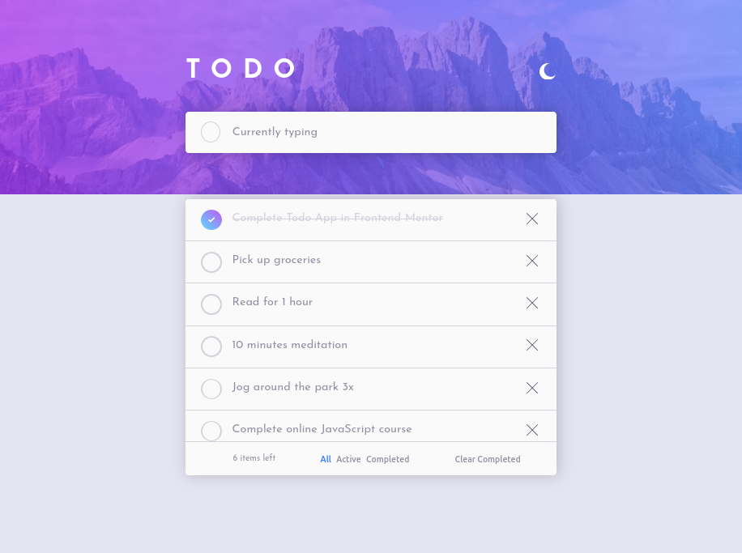
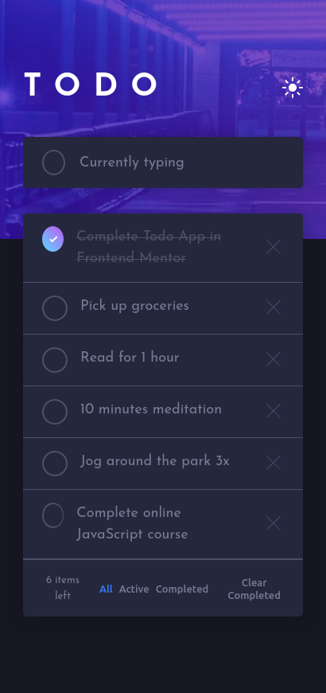

# Frontend Mentor - Todo app solution

This is a solution to the [Todo app challenge on Frontend Mentor](https://www.frontendmentor.io/challenges/todo-app-Su1_KokOW)

I have already completed this challenge but using **React Native** and **Expo**, it was my first time using it.

I have this proyect with its **apk** here : [note-app-react-native](https://github.com/Lio-n/note-app-react-native).

## Table of contents

- [Overview](#overview)
  - [The challenge](#the-challenge)
  - [Screenshot](#screenshot)
  - [Links](#links)
- [My process](#my-process)
  - [Built with](#built-with)
  - [What I learned](#what-i-learned)
  - [Continued development](#continued-development)
  - [Useful resources](#useful-resources)
- [Author](#author)
- [Acknowledgments](#acknowledgments)

## Overview

### The challenge

Your users should be able to:

- [x] View the optimal layout for the app depending on their device's screen size.
- [x] See hover states for all interactive elements on the page.
- [x] Add new todos to the list.
- [x] Mark todos as complete.
- [x] Delete todos from the list.
- [x] Filter by all/active/complete todos.
- [x] Clear all completed todos.
- [x] Toggle light and dark mode.
- [TODO] **Bonus**: Drag and drop to reorder items on the list.
- [TODO] **Bonus**: Re-edit items on the list.

### Screenshot

  

  

### Links

- Solution URL: [Github Repository : FM-note-app](https://github.com/Lio-n/FM-note-app)
- Live Site URL: [Vercel](https://fm-note-app.vercel.app/)

## My process

### Built with

- Semantic HTML5 markup
- CSS custom properties
- Flexbox
- Mobile-first workflow
- Typescript
- Atomic Design
- [Styled Compotents](https://styled-components.com/) - For styles
- [React](https://reactjs.org/) - JS library
- [Vite](https://vitejs.dev/)
- [Vitets](https://vitest.dev/) - For Testing

### What I learned

Vitest for Unit Testing React Components.

### Continued development

I need to improve with Unit Testing and Atomic Design.

### Useful resources

- [Atomic Design](https://www.designsystems.com/building-chimekit-with-atomic-design-and-a-collaborative-process/)

- [Vitest](https://vitest.dev/)

## Author

- Website - [Portfolio](https://www.leonardofontan.tech/)
- Frontend Mentor - [@Lio-n](https://www.frontendmentor.io/profile/Lio-n)
